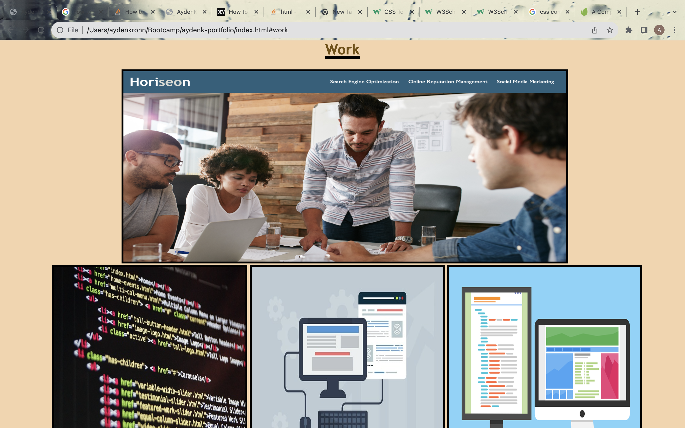
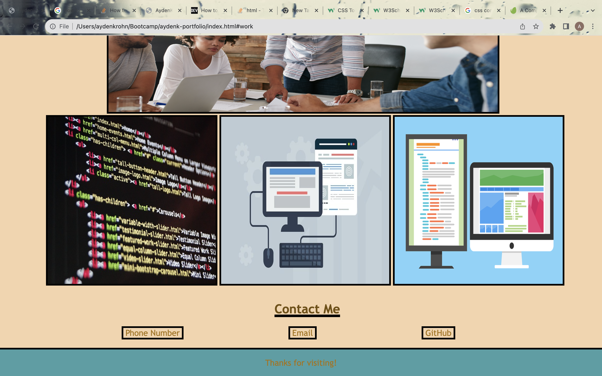

# AydenK Portfolio

## Description

Through this project, my goal was to make a webpage that can house my previous work in a portfolio. In my porfolio, I provide a brief description of myself, a collection of my previously made webpages, as well as a way to contact me. This website provided me with a way to showcase my knowledge in coding using HTML and CSS. In making my portfolio, I learned more about the importance of structure and syntax in both my HTML and CSS code. Additionally, I learned more about how to style my website using specific CSS properties like text-align, justify content, and root tags.

## Installation

To see my project, open the URL. There you will be meet with my webpage. To go to different sections, click the links in the navigation bar at the top. To view my work, click on the image and you will be taken to the webpage. If you click the contact me links, you will be taken to my phone number, email, and GitHub for this project. 

Website: https://krohnayden.github.io/aydenk-portfolio/

## Usage
You can use this website to store different projects and personal information for future projects. 

## Credits

### Photo Credit
Lisa Fotios - https://stocksnap.io/photo/widescreen-dramatic-RPYXEFBOBR
James Osborne - https://pixabay.com/photos/code-html-digital-coding-web-1076536/
200 degrees - https://pixabay.com/vectors/dual-screen-programming-coding-1745705/
Mudassa Iqbal - https://pixabay.com/illustrations/web-design-user-interface-website-3411373/

## License
License: MIT License